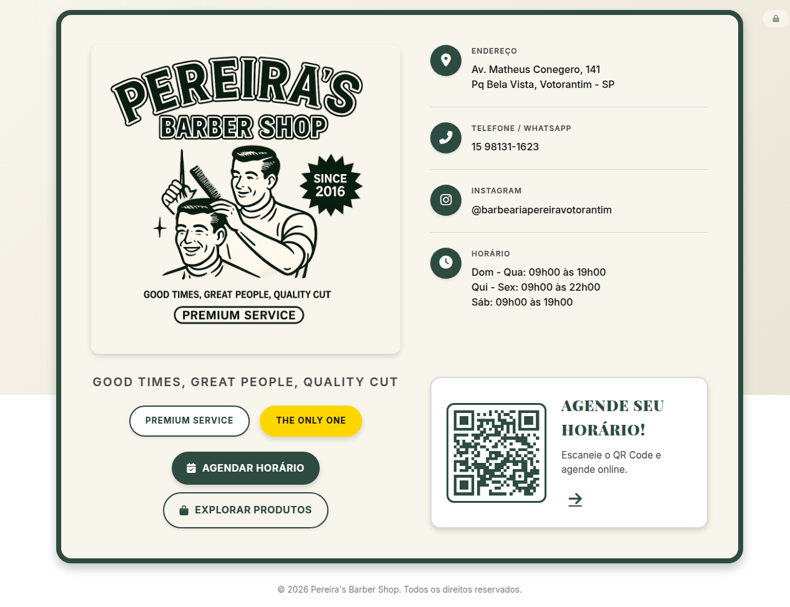
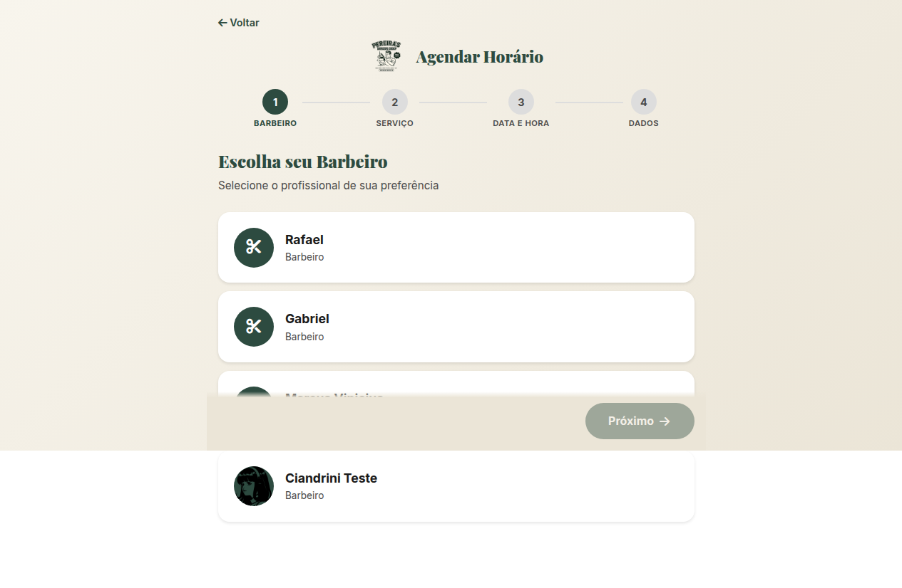

# ✂️ Pereira's Barber Shop

Sistema completo de agendamento online com painel administrativo, bot Telegram e lojinha de produtos.

[🌐 Visitar Site](https://www.pereira-barbershop.com.br) · [📅 Agendar Horário](https://www.pereira-barbershop.com.br/agendar.html) · [🛒 Lojinha](https://www.pereira-barbershop.com.br/produtos.html) · [👨‍💼 Painel Admin](https://www.pereira-barbershop.com.br/admin.html)

---

## 📋 Funcionalidades

### 🌐 Site Público
- **Landing Page** (`index.html`) — Apresentação da barbearia com serviços, galeria e QR Code para agendamento
- **Agendamento Online** (`agendar.html`) — Wizard de 4 etapas: barbeiro → serviços → data/horário → dados do cliente
- **Lojinha** (`produtos.html`) — Catálogo de produtos com carrinho e reserva para retirada na loja

### 👨‍💼 Painel Administrativo
- **Dashboard** (`admin.html`) — Login autenticado via Supabase Auth
- Gerenciamento de barbeiros, serviços, agendamentos e produtos
- Calendário visual com confirmação/cancelamento/reagendamento
- Notificações WhatsApp para clientes
- Sistema de pedidos de produtos
- Gerenciamento de usuários admin

### 🤖 Bot Telegram
- **Comandos disponíveis:**
  - `/start` — Boas-vindas com link do site
  - `/hoje` — Lista agendamentos do dia com nome, serviço e preço
- Notificação automática quando um novo agendamento é feito pelo site
- Identifica o barbeiro pelo `telegram_chat_id`

### 🔒 Segurança
- RLS (Row Level Security) no Supabase para proteção de dados
- RPCs com `SECURITY DEFINER` para acesso controlado via bot
- Políticas de acesso: anon (leitura limitada), authenticated (CRUD completo)
- Lista de admins controlada via tabela `admin_users`

---

## 🏗️ Arquitetura

```
├── index.html          # Landing page
├── style.css           # Estilos da landing
├── agendar.html/.js/.css   # Sistema de agendamento (wizard 4 etapas)
├── produtos.html/.js/.css  # Lojinha de produtos (wizard 3 etapas)
├── admin.html/.js/.css     # Painel administrativo (login + CRUD)
├── supabase-config.js      # Credenciais Supabase (URL + anon key)
├── favicon.svg / logo.png  # Assets visuais
│
├── api/
│   └── telegram.js     # Vercel Serverless Function — Bot Telegram webhook
│
├── docs/
│   ├── BOT_24_7.md              # Documentação do bot Telegram
│   ├── TELEGRAM_BARBEIROS.md    # Guia de setup para barbeiros
│   ├── MENSAGEM_GRUPO.txt       # Template para compartilhar no grupo
│   └── rpc-telegram-appointments.sql  # SQL da RPC do bot
│
├── scripts/
│   ├── configurar_webhook.sh    # Script para configurar webhook Telegram
│   └── README.md                # Documentação do script
│
├── assets/screenshots/          # Screenshots para documentação
│
├── supabase-schema.sql          # Schema do banco de dados (referência)
├── supabase-security-hardening.sql  # Políticas RLS e RPCs de segurança
└── vercel.json                  # Configuração de deploy no Vercel
```

---

## 🛠️ Tecnologias

- **Frontend:** HTML5, CSS3, JavaScript vanilla (sem framework)
- **Backend:** Supabase (PostgreSQL + Auth + Realtime)
- **Bot:** Telegram Bot API via Vercel Serverless Functions
- **Deploy:** Vercel (auto-deploy from GitHub `main`)
- **Domínio:** [www.pereira-barbershop.com.br](https://www.pereira-barbershop.com.br)

---

## 🚀 Setup & Deploy

### Pré-requisitos
- Conta no [Supabase](https://supabase.com) (projeto criado)
- Conta no [Vercel](https://vercel.com) (conectada ao GitHub)
- Bot Telegram criado via [@BotFather](https://t.me/BotFather)

### 1. Clone o repositório
```bash
git clone https://github.com/pantojinho/pereira-barbershop.git
cd pereira-barbershop
```

### 2. Configure o Supabase
1. Crie um projeto no Supabase
2. Execute `supabase-schema.sql` no SQL Editor para criar as tabelas
3. Execute `supabase-security-hardening.sql` para configurar RLS e RPCs
4. Execute `docs/rpc-telegram-appointments.sql` para criar a RPC do bot
5. Atualize `supabase-config.js` com sua URL e anon key

### 3. Configure o Bot Telegram
1. Crie um bot via [@BotFather](https://t.me/BotFather)
2. Copie o token para `api/telegram.js`
3. Configure o webhook:
```bash
# Edite o script com seu token e URL, depois execute:
bash scripts/configurar_webhook.sh
```

### 4. Deploy no Vercel
1. Conecte o repo ao Vercel
2. O deploy é automático a cada push na `main`
3. Configure o domínio personalizado no painel do Vercel

---

## 📊 Banco de Dados (Supabase)

### Tabelas Principais
- `barbers` — Barbeiros (nome, foto, chat_id Telegram, horários)
- `services` — Serviços oferecidos (nome, preço, duração)
- `appointments` — Agendamentos (cliente, barbeiro, data/hora, serviços, status)
- `products` — Produtos da lojinha
- `product_orders` — Pedidos de produtos
- `admin_users` — Lista de administradores autorizados
- `barber_schedules` — Horários de trabalho por dia da semana

### RPCs Principais
- `create_public_appointment` — Cria agendamento (valida conflito de horário)
- `get_public_booked_slots` — Lista horários ocupados
- `get_public_barbers` — Lista barbeiros ativos
- `get_public_services` — Lista serviços ativos
- `get_barber_appointments_today` — Agendamentos do dia para o bot Telegram

---

## 📸 Screenshots




---

## 📄 Licença

MIT © Pereira's Barber Shop

---

## 🔗 Links

[🌐 Site](https://www.pereira-barbershop.com.br) · [📅 Agendar](https://www.pereira-barbershop.com.br/agendar.html) · [📸 Instagram](https://instagram.com/barbeariapereiravotorantim) · [💬 WhatsApp](https://wa.me/5515981311623)
