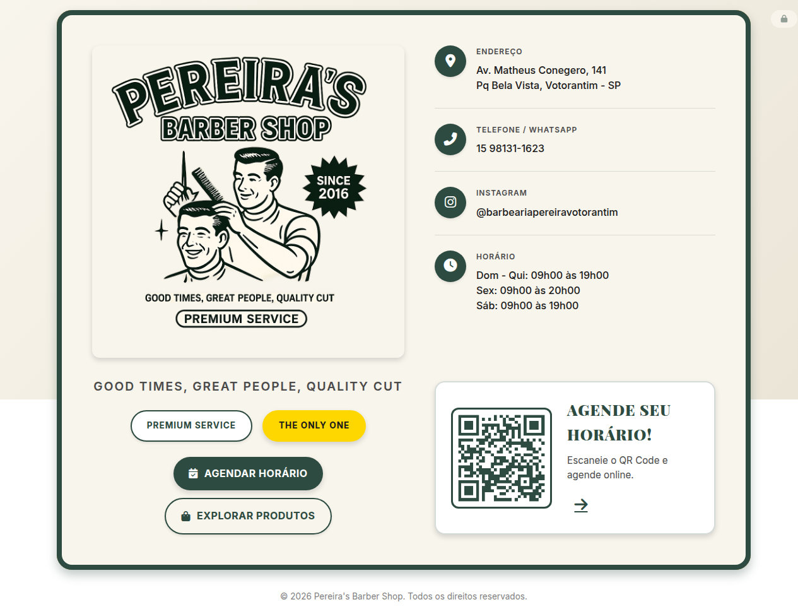
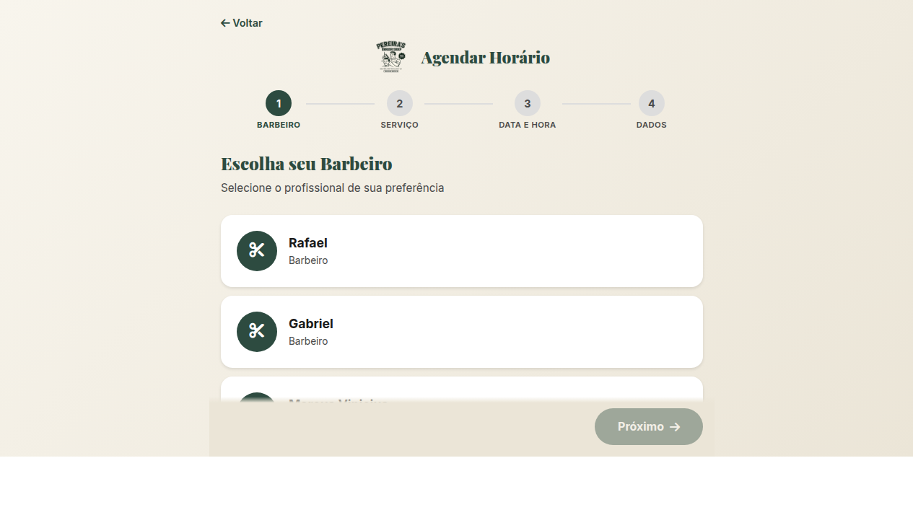
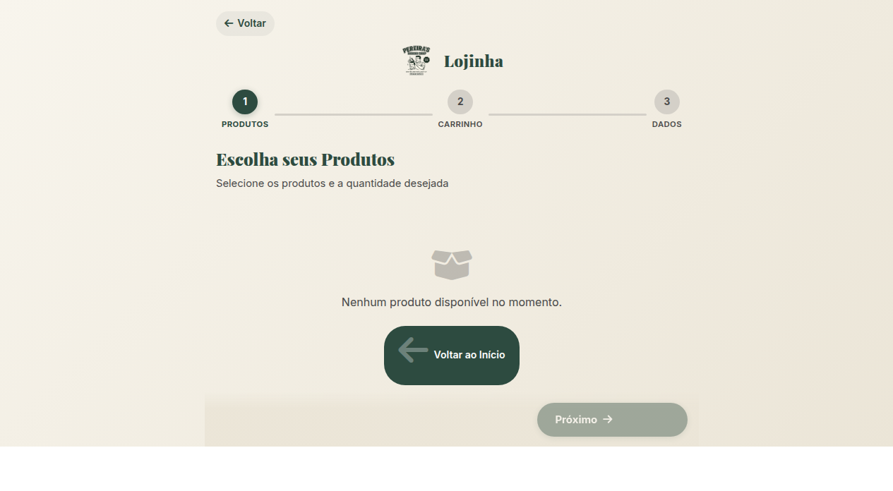

<div align="center">

# ✂️ Pereira's Barber Shop

### **Since 2016** — Votorantim, SP

[](https://www.pereira-barbershop.com.br)
[](https://vercel.com)
[](https://supabase.com)
[](https://developer.mozilla.org/pt-BR/docs/Web/HTML)
[](https://developer.mozilla.org/pt-BR/docs/Web/CSS)
[](https://developer.mozilla.org/pt-BR/docs/Web/JavaScript)
[](LICENSE)

<br>

**Site completo para barbearia** com landing page, agendamento online, lojinha de produtos e painel administrativo.

[🌐 Visitar Site](https://www.pereira-barbershop.com.br) · [📅 Agendar Horário](https://www.pereira-barbershop.com.br/agendar.html) · [🛒 Lojinha](https://www.pereira-barbershop.com.br/produtos.html) · [👨‍💼 Painel Admin](https://www.pereira-barbershop.com.br/admin.html)

<br>

<p align="center">
  
  
</p>
<p align="center">
  
  
</p>

</div>

---

## 📖 Sobre

**Pereira's Barber Shop** é uma barbearia tradicional localizada em **Votorantim, São Paulo**, atuando desde **2016**. Este projeto é o site oficial da barbearia, funcionando como um **cartão de visitas digital** completo com sistema de agendamento, lojinha de produtos e gestão administrativa — tudo integrado em uma plataforma moderna e responsiva.

Construído com **HTML, CSS e JavaScript puros** (sem frameworks), utilizando **Supabase** como backend (PostgreSQL, Auth e Storage) e deploy contínuo via **Vercel**. Para desenvolvimento local, um servidor **FastAPI** é utilizado.

---

## ⚡ Funcionalidades

- 🏠 **Landing Page** — Cartão de visitas digital com identidade visual vintage, informações de contato, serviços, barbeiros e QR Code para agendamento
- 📅 **Agendamento Online** — Fluxo completo em 4 passos: Escolher Barbeiro → Selecionar Serviço(s) → Data e Horário → Dados do Cliente + Confirmação
- 🛒 **Lojinha de Produtos** — Catálogo com carrinho de compras, controle de estoque em tempo real e checkout via WhatsApp
- 👨‍💼 **Painel Administrativo** — Dashboard completo com CRUD de barbeiros, serviços, produtos, pedidos, feriados e administradores
- 🔐 **Autenticação** — Sistema de login seguro para administradores e barbeiros (via Supabase Auth)
- 📱 **100% Responsivo** — Design mobile-first que funciona perfeitamente em qualquer dispositivo
- 🔔 **Confirmação via WhatsApp** — Links de confirmação gerados automaticamente após agendamento ou pedido
- 🏖️ **Sistema de Feriados** — Configuração de dias de folga que bloqueiam automaticamente a agenda
- 📊 **Dashboard com Estatísticas** — Visualização de agendamentos, faturamento e métricas de desempenho

---

## 🎬 Demonstração

| Página | URL | Descrição |
|---|---|---|
| 🌐 Site Principal | [pereira-barbershop.com.br](https://www.pereira-barbershop.com.br) | Landing page com informações da barbearia |
| 📅 Agendamento | [/agendar.html](https://www.pereira-barbershop.com.br/agendar.html) | Sistema de agendamento online |
| 🛒 Lojinha | [/produtos.html](https://www.pereira-barbershop.com.br/produtos.html) | Catálogo e carrinho de produtos |
| 👨‍💼 Admin | [/admin.html](https://www.pereira-barbershop.com.br/admin.html) | Painel administrativo (login necessário) |

---

## 🛠️ Tech Stack

| Tecnologia | Uso | Logo |
|---|---|---|
| **HTML5** | Estrutura e semântica das páginas |  |
| **CSS3** | Estilização, responsividade, animações |  |
| **JavaScript** | Lógica de aplicação, integração com APIs |  |
| **Supabase** | Banco de dados (PostgreSQL), Auth, Storage |  |
| **Vercel** | Deploy e hospedagem (CI/CD automático) |  |
| **FastAPI** | Servidor local para desenvolvimento |  |

---

## 📁 Arquitetura

```
pereira-barbershop/
├── 📄 index.html                    # Landing page principal
├── 🎨 style.css                     # Estilos da landing page
├── 📄 agendar.html                  # Página de agendamento
├── 🎨 agendar.css                   # Estilos do agendamento
├── ⚙️ agendar.js                    # Lógica do agendamento
├── 📄 produtos.html                  # Lojinha de produtos
├── 🎨 produtos.css                   # Estilos da lojinha
├── ⚙️ produtos.js                    # Lógica do carrinho e pedidos
├── 📄 admin.html                    # Painel administrativo
├── 🎨 admin.css                     # Estilos do painel admin
├── ⚙️ admin.js                      # Lógica do painel admin
├── ⚙️ supabase-config.js            # Configuração Supabase (gitignored)
├── 🗃️ supabase-schema.sql           # SQL — criação das tabelas
├── 🔒 supabase-security-hardening.sql # SQL — RLS + políticas de segurança
├── 🖼️ logo.png                      # Logo oficial
├── 🖼️ favicon.svg                   # Favicon
├── ⚙️ vercel.json                   # Configuração Vercel (deploy estático)
├── 🐍 server.py                     # Servidor local FastAPI
├── 📋 requirements.txt              # Dependências Python (gitignored)
├── 📁 static/                       # Arquivos para servidor local
│   ├── index.html
│   ├── style.css
│   ├── agendar.html
│   ├── agendar.css
│   ├── agendar.js
│   ├── admin.html
│   ├── admin.css
│   ├── admin.js
│   ├── produtos.html
│   ├── produtos.css
│   ├── produtos.js
│   ├── supabase-config.js
│   ├── logo.png
│   └── favicon.svg
├── 📄 AGENTS.md                     # Memória para agentes de IA
├── 📄 README.md                     # Este arquivo
└── 📄 .gitignore                    # Arquivos ignorados pelo Git
```

---

## 🚀 Começando

### Pré-requisitos

- **Git** — para clonar o repositório
- **Python 3.8+** — para rodar o servidor local (opcional)
- **Conta no Supabase** — para o banco de dados e autenticação
- **Conta no Vercel** — para deploy (opcional)

### Instalação Local

```bash
# 1. Clone o repositório
git clone https://github.com/pantojinho/pereira-barbershop.git
cd pereira-barbershop

# 2. Crie o arquivo de configuração do Supabase
cp supabase-config.js.example supabase-config.js
# Edite com suas credenciais do Supabase

# 3. (Opcional) Instale dependências do servidor local
pip install fastapi uvicorn

# 4. (Opcional) Inicie o servidor local
python server.py
# Acesse: http://localhost:8000
```

> 💡 **Dica:** Você também pode abrir o `index.html` diretamente no navegador para visualizar a landing page.

### Variáveis de Ambiente

Crie o arquivo `supabase-config.js` na raiz do projeto com as seguintes credenciais:

```javascript
const SUPABASE_URL = 'https://seu-projeto.supabase.co';
const SUPABASE_ANON_KEY = 'sua-anon-key-aqui';
```

> ⚠️ **Importante:** Este arquivo está no `.gitignore` e **nunca** deve ser commitado no repositório.

---

## 🗄️ Banco de Dados

O banco de dados utiliza **PostgreSQL** via Supabase com as seguintes tabelas:

```
┌─────────────────────────────────────────────────────────────────┐
│                     SCHEMA: public                              │
├─────────────────────────────────────────────────────────────────┤
│                                                                 │
│  ┌──────────┐    ┌───────────┐    ┌──────────────┐             │
│  │ barbers  │    │ services  │    │ appointments │             │
│  ├──────────┤    ├───────────┤    ├──────────────┤             │
│  │ id (PK)  │    │ id (PK)   │    │ id (PK)      │             │
│  │ name     │    │ name      │    │ barber_id(FK)│──► barbers  │
│  │ photo    │    │ price     │    │ service_id(FK)│──► services │
│  │ active   │    │ duration  │    │ date         │             │
│  │ order    │    │ active    │    │ time         │             │
│  └──────────┘    │ order     │    │ client_name  │             │
│                  └───────────┘    │ client_phone │             │
│                                   │ status       │             │
│  ┌──────────┐    ┌──────────────┐ └──────────────┘             │
│  │ products │    │product_orders│                              │
│  ├──────────┤    ├──────────────┤                              │
│  │ id (PK)  │    │ id (PK)      │                              │
│  │ name     │    │ products (JSON)│──► products                │
│  │ price    │    │ client_name  │                              │
│  │ image    │    │ client_phone │                              │
│  │ stock    │    │ total        │                              │
│  │ active   │    │ status       │                              │
│  └──────────┘    └──────────────┘                              │
│                                                                 │
│  ┌──────────┐    ┌──────────┐                                  │
│  │ holidays │    │  admins  │                                  │
│  ├──────────┤    ├──────────┤                                  │
│  │ id (PK)  │    │ id (PK)  │                                  │
│  │ date     │    │ email    │                                  │
│  │ description│  │ role     │                                  │
│  └──────────┘    └──────────┘                                  │
│                                                                 │
└─────────────────────────────────────────────────────────────────┘
```

### Detalhes das Tabelas

- **barbers** — Barbeiros da equipe (nome, foto, status ativo)
- **services** — Serviços oferecidos com preço e duração
- **appointments** — Agendamentos realizados (barbeiro, serviço, data/hora, cliente)
- **products** — Produtos da lojinha com controle de estoque
- **product_orders** — Pedidos da lojinha com itens em JSON
- **holidays** — Dias de folga que bloqueiam a agenda
- **admins** — Administradores do sistema com roles

> 📋 O SQL completo de criação está em `supabase-schema.sql` e as políticas de segurança em `supabase-security-hardening.sql`.

---

## 🌍 Deploy no Vercel

O deploy é automático via **Vercel** a cada push na branch `main`.

### Configuração

O arquivo `vercel.json` já está configurado para deploy estático:

```json
{
  "framework": null,
  "buildCommand": null,
  "installCommand": null,
  "outputDirectory": "."
}
```

### Passos para Deploy

1. **Fork** ou clone este repositório
2. Acesse [vercel.com](https://vercel.com) e faça login
3. Clique em **"New Project"** → Importe o repositório
4. Configure as variáveis de ambiente (se necessário)
5. Clique em **"Deploy"**

> ⚠️ **Atenção:** Nunca commit o `requirements.txt` no repositório — isso faz o Vercel detectar o projeto como Python e quebrar o deploy estático.

---

## 🗺️ Roadmap

Próximas funcionalidades planejadas:

- [ ] 📲 **Notificações WhatsApp** — Lembretes automáticos de agendamento via Evolution API / Z-API
- [ ] 🤖 **Chatbot** — Atendimento automatizado via WhatsApp
- [ ] 📧 **Notificações Push/E-mail** — Alertas para clientes e administradores
- [ ] 📈 **Relatórios Avançados** — Exportação de dados e gráficos detalhados
- [ ] ⭐ **Sistema de Avaliação** — Clientes avaliam barbeiros e serviços
- [ ] 🔐 **Login de Barbeiros** — Cada barbeiro visualiza sua própria agenda
- [ ] 📆 **Recorrência** — Agendamentos fixos semanais/mensais
- [ ] 💳 **Pagamento Online** — Integração com gateway de pagamento
- [ ] 🎁 **Programa de Fidelidade** — Pontos e recompensas para clientes frequentes

---

## 🤝 Contribuindo

Contribuições são bem-vindas! Siga os passos abaixo:

1. **Fork** este repositório
2. Crie uma **branch** para sua feature (`git checkout -b feature/minha-feature`)
3. Faça o **commit** das alterações (`git commit -m 'feat: minha nova feature'`)
4. Faça o **push** para a branch (`git push origin feature/minha-feature`)
5. Abra um **Pull Request**

### Padrões do Projeto

- **HTML/CSS/JS puros** — sem frameworks frontend
- Arquivos na **raiz** são usados pelo Vercel
- Arquivos em `static/` são usados pelo servidor local FastAPI
- Sempre atualize **ambos** ao editar HTML/CSS/assets
- `supabase-config.js` e `requirements.txt` **nunca** vão para o Git

---

## 📄 Licença

Este projeto está sob a licença **MIT**. Veja o arquivo [LICENSE](LICENSE) para mais detalhes.

```
MIT License

Copyright (c) 2016-presente Pereira's Barber Shop

Permission is hereby granted, free of charge, to any person obtaining a copy
of this software and associated documentation files (the "Software"), to deal
in the Software without restriction, including without limitation the rights
to use, copy, modify, merge, publish, distribute, sublicense, and/or sell
copies of the Software, and to permit persons to whom the Software is
furnished to do so, subject to the following conditions:

The above copyright notice and this permission notice shall be included in all
copies or substantial portions of the Software.

THE SOFTWARE IS PROVIDED "AS IS", WITHOUT WARRANTY OF ANY KIND, EXPRESS OR
IMPLIED, INCLUDING BUT NOT LIMITED TO THE WARRANTIES OF MERCHANTABILITY,
FITNESS FOR A PARTICULAR PURPOSE AND NONINFRINGEMENT. IN NO EVENT SHALL THE
AUTHORS OR COPYRIGHT HOLDERS BE LIABLE FOR ANY CLAIM, DAMAGES OR OTHER
LIABILITY, WHETHER IN AN ACTION OF CONTRACT, TORT OR OTHERWISE, ARISING FROM,
OUT OF OR IN CONNECTION WITH THE SOFTWARE OR THE USE OR OTHER DEALINGS IN THE
SOFTWARE.
```

---

## 📞 Contato

<div align="center">

### ✂️ Pereira's Barber Shop — **Since 2016**

📍 **Endereço:** Av. Matheus Conegero, 141, Pq Bela Vista, Votorantim - SP

📞 **Telefone/WhatsApp:** 15 98131-1623

📸 **Instagram:** [@barbeariapereiravotorantim](https://instagram.com/barbeariapereiravotorantim)

🕐 **Horário de Funcionamento:**
Segunda a Sábado: 09h às 19h
Domingo: Fechado

---

### Nossa Equipe

💈 **Rafael** · 💈 **Gabriel** · 💈 **Marcus Vinicius**

### Serviços e Preços

✂️ Corte (sobrancelha cortesia) — **R$ 43,00** · 1h
🪒 Corte + Barbaterapia (sobrancelha cortesia) — **R$ 75,00** · 1h20
🧔 Barbaterapia (pezinho cortesia) — **R$ 43,00** · 1h
👃 Orelha e Nariz com cera — **R$ 25,00** · 30min
✨ Selagem — **R$ 50,00** · 1h

---

[🌐 Site](https://www.pereira-barbershop.com.br) · [📅 Agendar](https://www.pereira-barbershop.com.br/agendar.html) · [🛒 Lojinha](https://www.pereira-barbershop.com.br/produtos.html) · [📸 Instagram](https://instagram.com/barbeariapereiravotorantim) · [💬 WhatsApp](https://wa.me/5515981311623)

</div>
